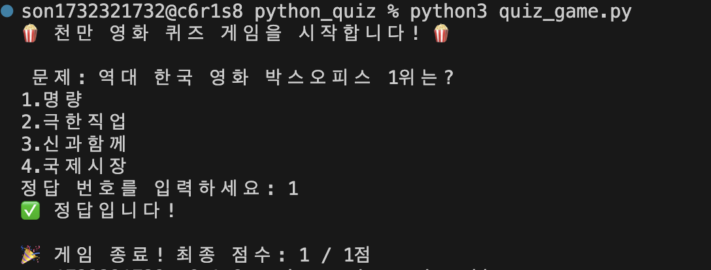

<dr>
# **Python과 Git으로 만드는 나만의 콘솔 퀴즈 게임**
#### Python 기본 문법과 클래스 개념을 활용하여 터미널에서 동작하는 퀴즈 게임을 구현하는 프로젝트입니다. 메뉴 기반 입력 흐름, 퀴즈 출제/등록/목록/점수 확인 기능을 만들고, JSON 파일 저장을 통해 프로그램 종료 후에도 데이터가 유지되도록 구현합니다. 또한 Git과 GitHub를 사용해 기능별 변경 이력을 관리하며 개발 과정을 기록합니다.
---
<dr>
<dr>

> ##  2) 파이썬 퀴즈 프로젝트 진행 기록 

### ① 프로젝트 기초 공사 (작업실 세팅)
- mkdir python_quiz : 프로젝트 폴더 생성 
- cd python_quiz : 폴더로 이동
- git init / git config : Git 로컬 저장소 생성 및 사용자 정보(이름/이메일) 설정

### ② 첫 기록 남기기 (로컬 저장소 저장)
- touch README.md : 프로젝트 설명서 파일 생성
- quiz_game.py 작성 : 파이썬 클래스 구조와 기본 실행 코드 작성
- git add . : 변경된 전체 파일 스테이징(Staging)
- git commit -m "Initial commit: 프로젝트 시작 및 README 작성" : 첫 번째 버전 기록 

### ③ 세상에 공개하기 (GitHub 연결)
- GitHub 저장소 생성 : python_quiz(VS 코드 폴더명과 일치시킴)
- git remote add origin [URL] : GitHub 원격 저장소 연결
- git branch -M main : 기본 브랜치명을 main으로 설정
- git push -u origin main : 로컬 커밋 내역을 GitHub로 최종 업로드

### ④ 클래스 기본 구조 설계 (객체 지향 설계)
- class Quiz: : 개별 퀴즈 데이터(질문, 보기, 정답)를 담아둘 붕어빵 틀 만들기
- class QuizGame: : 게임 전체 흐름(문제 출제, 점수 계산)을 관리하는 틀 만들기. 
**클래스(Class)란** 똑같은 모양의 객체를 찍어내기 위한 '붕어빵 틀(설계도)'(Quiz라는 틀 하나만 만들어두면
재료(질문, 정답)만 바꿔서 100개의 퀴즈 객체를 만듬 -> 코드를 반복해서 쓰지 않아도 되는 것이 핵심입니다. (재사용성))
- __init__(초기화 메서드) : 클래스가 생성될 때 필요한 초기 변수(속성) 설정하기
- 임시 데이터 테스트 : 만든 클래스로 객체를 생성해서 코드가 잘 실행되는지 확인하기
```zsh
# 1. 개별 퀴즈 데이터를 담는 클래스 (퀴즈 붕어빵 틀)
class Quiz:
    # 퀴즈가 만들어질 때 질문, 보기, 정답을 초기화(세팅)하는 메서드
    def __init__(self, question, options, answer):
        self.question = question
        self.options = options
        self.answer = answer

# 2. 퀴즈 게임 전체 흐름을 관리하는 클래스 (게임기)
class QuizGame:
     # 게임기가 켜질 때 초기 상태를 세팅하는 메서드
    def __init__(self):
        self.quizzes = [] # 여러 개의 퀴즈(Quiz 객체)를 담아둘 빈 주머니(리스트)
        self.score = 0    # 플레이어의 현재 점수 (0점으로 시작)

    # 게임을 시작하는 기능을 가진 메서드
    def start_game(self):
        print("게임을 시작합니다!") # 화면에 시작 메시지 출력

# 3. 프로그램 실행 부분(파이썬 파일이 직접 실행될 때만 아래 코드를 작동)
if __name__ == "__main__":
    game = QuizGame() # QuizGame 클래스(틀)를 이용해 'game'이라는 실제 게임기(객체) 생성
    game.start_game() # 만들어진 게임기의 start_game() 기능 실행

    # 보기(options)가 들어간 퀴즈 객체를 하나 만들어봅니다.
    test_quiz = Quiz("파이썬의 창시자는?", ["1. 스티브 잡스", "2. 귀도 반 로섬", "3. 일론 머스크"], 2)

    print("\n--- 임시 데이터 테스트 ---")
    print("질문:", test_quiz.question)
    print("보기:", test_quiz.options)
    print("정답 번호:", test_quiz.answer)
    print("테스트 성공! 클래스가 완벽하게 작동합니다. 🎉")
```
- 실핼화면 : 

### * 파이썬 클래스 기초 용어 & 기호
- **() 소괄호 : 실행 or 재료 전달** game.start_game() 이 기능 실행해!, Quiz("질문") 괄호 안의 재료(데이터) 전달!  
  * def 이름(재료이름): "나한테 이 재료를 줘!" (규칙 정하기 / 준비)  
  * 이름(진짜재료) "자, 여기 진짜 재료 받아!" (실제 전달 / 실행)  
- **[] 대괄호 : 리스트 (바구니)** 여러 데이터를 담는 통. ([]는 빈 바구니)
- **등호 = : 대입 (저장)** 오른쪽 값을 왼쪽에 저장해라! (score = 0)
- **이중 등호 == : (비교 연산자)** 비교 두 값이 같은지 확인해라! (answer == "기생충" → True / False)
- **def : 기능 (메서드)** 클래스 안에서 작동하는 함수.
- **self (나 자신)** 여러 객체가 만들어졌을 때, "지금 다루고 있는 이 객체" 를 가리키는 이름표(self.question = "다른 퀴즈 말고, 나(self)의 질문")
- **print() : 화면 출력 함수** 화면(콘솔)에 원하는 데이터(글자, 숫자 등)를 출력해서 보여주는 파이썬의 기본 내장 함수
- **점(.) : 소속 표시** "~의" (객체와 메서드/속성 사이)
- **밑줄(_) : 단어 연결** 띄어쓰기 대신 (변수/함수 이름 안에서) 
- **객체(Object)/속성(Attribute)/메서드(Method)/함수(Function)의 개념**  
  * 객체(Object) : 클래스(설계도)를 바탕으로 만들어낸 실제 결과물(game = QuizGame() # QuizGame 클래스로 'game'이라는 객체를 만듦)
  * 속성(Attribute) : 객체 안에 저장된 **데이터(변수)**(game.score = 10 # game 객체 안에 있는 'score'라는 데이터)
  * 메서드(Method) : 객체에 소속된 실행하는 **기능(함수)**(game.play() # game에 있는 'play()'라는 기능 # 실행 객체 이름 뒤에 점(.)을 찍고 사용)
  * 함수 (Function) : 특정 객체에 소속되지 않고 혼자서 독립적으로 실행할 수 있는 기능 # print(), len() 이름 뒤에 바로 괄호 ()를 붙여서 씀)

### ⑤ 클래스 기능(메서드) 구현 
- Quiz 클래스 기능 추가 : 문제를 화면에 보여주는 display()와 정답을 확인하는 check_answer() 메서드 만들기
- QuizGame 클래스 기능 추가 : 퀴즈들을 하나씩 꺼내서 사용자에게 풀게 하고 점수를 계산하는 play() 메서드 만들기
- 사용자 입력 받기 : input() 함수를 사용해 플레이어가 직접 키보드로 정답을 입력하도록 구현
- 게임 실행 : 실제 퀴즈 데이터(객체)를 리스트에 담아 게임기에 넣고 작동시키기
```zsh
class Quiz:
    def __init__(self, questions, options, answer):
        self.questions = questions
        self.options = options
        self.answer = answer

    # 메서드 1: 퀴즈 출력 (문제와 4개의 보기를 화면에 보여줌)
    def display(self):
        print(f"\n 문제: {self.questions}")
        for i in range(4):
            print(f"{i+1}.{self.options[i]}")

    # 메서드 2: 정답 확인 (사용자가 입력한 답과 정답이 맞는지 확인)
    def check_answer(self, user_answer):
        if user_answer == self.answer:
            return True
        else:
            return False

class QuizGame:
    def __init__(self, questions):
        self.questions = questions # 여러 개의 퀴즈들을 넘겨받아 저장
        self.score = 0    

    def play(self):
        print("🍿 천만 영화 퀴즈 게임을 시작합니다! 🍿") 

         # questions 상자 안에 있는 퀴즈들을 하나씩 꺼내서 진행
        for quiz in self.questions:
            quiz.display() # 문제 보여주기
            # 사용자에게 키보드로 정답 입력받기 (문자를 숫자로 변환하기 위해 int 사용)
            user_input = int(input("정답 번호를 입력하세요: "))
            # 정답 확인하기
            if quiz.check_answer(user_input):
                print("✅ 정답입니다!")
                self.score += 1 # 정답이면 점수 1점 증가
            else:
                print(f"❌ 땡! 정답은 {quiz.answer}번입니다.")

    # 게임이 모두 끝나면 최종 점수 출력
        print(f"\n🎉 게임 종료! 최종 점수: {self.score} / {len(self.questions)}점")


# 3. 실제로 게임 작동시키기 (실행 부분)
# 천만 영화 문제 1개를 만듭니다.
movie_quizzes = [
     Quiz("역대 한국 영화 박스오피스 1위는?", ["명량", "극한직업", "신과함께", "국제시장"], 1),
]

# 게임 매니저에게 문제 목록을 넘겨주고 게임 생성
game = QuizGame(movie_quizzes)

# 게임 시작! (버튼 누르기)
game.play()
```
- 실핼화면 : 

### * 파이썬 클래스 기초 용어 & 기호
- **f-string : (f"문자열")** 문자열 앞에 f를 붙이고 중괄호 {} 안에 변수를 넣으면, 글자와 데이터를 아주 쉽게 섞어서 출력할 수 있는 마법의 문법. (f"최종 점수: {self.score}점")
- **range()** : 숫자의 범위를 만들어주는 함수. range(4)는 0, 1, 2, 3을 만들어냄.
- **input()** : 프로그램 실행 중 사용자에게 키보드로 값을 입력받는 함수. (입력받은 값은 무조건 '문자'로 취급됨)
- **int(**) : 데이터를 정수(숫자)로 변환해 주는 함수. 사용자가 입력한 문자("1")를 숫자(1)로 바꿔서 정답과 비교하기 위해 int(input()) 형태로 사용.
- **return** : 함수나 메서드가 작업을 끝내고 결과값을 호출한 곳으로 돌려주는 키워드.
- **+= (더하기 할당 연산자)** : 기존 값에 더해서 다시 저장해라! self.score += 1은 self.score = self.score + 1과 같은 뜻.
- **len()** : 리스트 같은 바구니 안에 데이터가 몇 개 들어있는지 **길이(개수)**를 세어주는 내장 함수. (len(self.questions) → 퀴즈가 총 몇 문제인지 알려줌)

### ⑥ 천만 영화 퀴즈 5문제 실행 및 메인 메뉴 시스템 구축
- 퀴즈 주제 선정 및 5문제 세팅 : 영화 '왕의 남자'를 보고 깊은 감명을 받아, 한국 영화 역사상 천만 관객을 동원한 다른 명작들에 대한 호기심이 생겼습니다. 이를 바탕으로 대중적으로 가장 친숙한 '역대 한국 천만 영화'를 주제로 선정하여 사용자의 공감과 몰입도를 높였습니다. 총 5개의 퀴즈 데이터를 리스트에 담아 준비했습니다.
- 메인 메뉴 시스템 구축 : while True 무한 루프를 사용하여 프로그램 시작 화면을 만들고, 게임이 끝나도 종료되지 않고 메뉴로 돌아오도록 구현.
- 조건문 분기 처리 : if/elif/else를 활용해 사용자가 입력한 번호(1~5)에 따라 퀴즈 풀기, 추가, 목록 보기, 점수 확인, 종료 기능이 각각 실행되도록 길을 나누어 줌.
- 점수별 피드백 제공 : 게임 종료 후 최종 점수에 따라 다른 결과 메시지(만점/보통/아쉬움)를 출력하여 사용자 경험(UX) 개선.
- 예외 처리 (에러 방지) : 사용자가 실수로 빈칸을 입력하거나 문자를 입력했을 때 프로그램이 튕기지 않도록 try/except와 strip()을 활용해 안전하게 처리. Ctrl+C 입력 시에도 부드럽게 종료되도록 구현.
 ```zsh
 class Quiz:
    def __init__(self, question, options, answer):
        self.question = question
        self.options = options
        self.answer = answer

    def display(self):
        print(f"\n문제: {self.question}")
        for i in range(len(self.options)):
            print(f"{i+1}. {self.options[i]}")

    def check_answer(self, user_answer):
        if user_answer == self.answer:
            return True
        else:
            return False

class QuizGame:
    def __init__(self, questions):
        self.questions = questions
        self.score = 0

    def play(self):
        self.score = 0
        print("\n🍿 천만 영화 퀴즈 게임을 시작합니다! 🍿")

        for quiz in self.questions:
            quiz.display()

            # 💡 올바른 정답을 입력할 때까지 계속 물어보는 반복문
            while True:
                try:
                    raw = input("정답 번호를 입력하세요 (1~4): ").strip()

                    if raw == "":  # 빈 입력 처리
                        print("⚠️ 번호를 입력해주세요.")
                        continue

                    user_input = int(raw)  # 문자 -> 숫자 변환

                    if user_input < 1 or user_input > 4:  # 범위 벗어남 처리
                        print("⚠️ 1~4 사이의 번호만 입력할 수 있어요.")
                        continue

                    break  # 정상 입력 -> while 탈출하고 채점으로 넘어감

                except ValueError:  # abc처럼 숫자 변환 실패 시
                    print("⚠️ 숫자만 입력해주세요! (예: 1)")

            # 채점
            if quiz.check_answer(user_input):
                print("✅ 정답입니다! 🎉")
                self.score += 1
            else:
                print(f"❌ 땡! 오답입니다. 😢 (정답은 {quiz.answer}번)")

        # 결과 출력
        print(f"\n게임 종료! 최종 점수 {self.score} / {len(self.questions)}점 입니다.")

        if self.score == len(self.questions):
            print("🏆 완벽합니다! 당신은 진정한 천만 영화 마스터!")
        elif self.score >= 3:
            print("👍 훌륭합니다! 영화를 꽤 좋아하시는군요!")
        else:
            print("🎬 아쉽네요. 이번 주말엔 영화 감상 어떠신가요?")


# --- 🎬 1. 퀴즈 데이터 준비 ---
movie_questions = [
    Quiz("영화 '명량'에서 이순신 장군 역을 맡은 배우는?", ["송강호", "최민식", "류승룡", "황정민"], 2),
    Quiz("영화 '극한직업'에서 형사들이 위장 창업한 가게의 메뉴는?", ["짜장면", "피자", "수원왕갈비통닭", "마라탕"], 3),
    Quiz("영화 '신과함께-죄와 벌'에서 주인공 자홍의 직업은?", ["경찰", "소방관", "의사", "변호사"], 2),
    Quiz("영화 '국제시장'의 배경이 되는 부산의 시장 이름은?", ["자갈치시장", "국제시장", "부전시장", "해운대시장"], 2),
    Quiz("영화 '괴물'에서 괴물이 나타난 장소는?", ["한강", "해운대", "남산", "제주도"], 1)
]

# --- 🎮 2. 게임 객체 생성 ---
game = QuizGame(movie_questions)


# --- 🖥️ 3. 메인 메뉴 시스템 (무한 반복) ---
while True:
    print("\n=== 🎬 천만 영화 퀴즈 게임 ===")
    print("1. 퀴즈 풀기")
    print("2. 퀴즈 추가하기 (준비 중)")
    print("3. 퀴즈 목록 보기 (준비 중)")
    print("4. 최근 점수 확인 (준비 중)")
    print("5. 게임 종료")
    
    try:
        choice = input("원하는 메뉴 번호를 입력하세요 (1~5): ").strip()
        
        if choice == "":
            print("⚠️ 아무것도 입력되지 않았어요. 번호를 입력해주세요.")
            continue
            
        if choice == '1':
            game.play()  # 퀴즈 게임 실행!
        elif choice == '2':
            print("🛠️ 퀴즈 추가 기능은 아직 준비 중입니다.")
        elif choice == '3':
            print("🛠️ 퀴즈 목록 보기 기능은 아직 준비 중입니다.")
        elif choice == '4':
            print("🛠️ 최근 점수 확인 기능은 아직 준비 중입니다.")
        elif choice == '5':
            print("👋 게임을 종료합니다. 플레이해주셔서 감사합니다!")
            break  # while 반복문 탈출 -> 프로그램 종료
        else:
            print("❌ 잘못된 입력입니다. 1~5 사이의 숫자를 입력해주세요.")
            
    except KeyboardInterrupt:
        print("\n\n🚨 강제 종료되었습니다. 안녕히 가세요!")
        break
    except EOFError:
        print("\n\n🚨 입력이 끊겼습니다. 게임을 종료합니다.")
        break
```
### * 파이썬 클래스 기초 용어 & 기호
- **for 루프 : (반복문)** 반복할 횟수가 명확하게 정해져 있을 때 데이터를 하나씩 꺼내며 반복 작업. (for quiz in self.questions: 질문 상자에서 퀴즈를 하나씩 꺼내서 quiz라고 부르겠다!)
- **while 루프 : (조건 반복문)** 반복할 횟수는 모르지만, 특정 조건이 참(True)인 동안 계속해서 반복 작업. (while answer != "종료": 사용자가 "종료"라고 입력하지 않는 동안에는 계속 게임을 진행하겠다!)
- **break : (반복문 탈출)** 작동 중인 반복문(while이나 for)을 즉시 부수고 밖으로 빠져나가는 마법의 단어. (게임 종료 시 사용)
- **strip() : (공백 제거)** 문자열 양옆에 있는 지저분한 띄어쓰기나 줄바꿈을 깔끔하게 잘라내 주는 함수. (사용자가 " 1 "이라고 쳐도 "1"로 인식하게 해줌)
- **try / except : (예외 처리)** 에러가 날 것 같은 코드를 try에 넣고, 만약 에러가 터지면 프로그램이 죽는 대신 except로 빠져서 내가 준비한 대처법을 실행하게 만드는 안전장치.
- **KeyboardInterrupt** : 사용자가 프로그램 실행 중에 강제로 Ctrl + C를 눌러서 끄려고 할 때 발생하는 에러 이름.