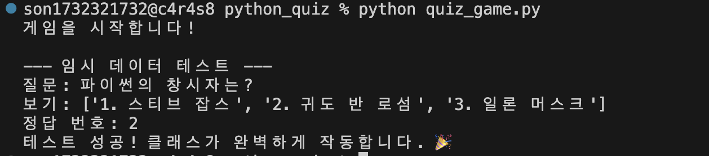

# **Python과 Git으로 만드는 나만의 콘솔 퀴즈 게임**
#### Python 기본 문법과 클래스 개념을 활용하여 터미널에서 동작하는 퀴즈 게임을 구현하는 프로젝트입니다. 메뉴 기반 입력 흐름, 퀴즈 출제/등록/목록/점수 확인 기능을 만들고, JSON 파일 저장을 통해 프로그램 종료 후에도 데이터가 유지되도록 구현합니다. 또한 Git과 GitHub를 사용해 기능별 변경 이력을 관리하며 개발 과정을 기록합니다.
---

<dr>
<dr>

> ##  2) 파이썬 퀴즈 프로젝트 진행 기록 

### ① 프로젝트 기초 공사 (작업실 세팅)
- mkdir python_quiz : 프로젝트 폴더 생성 
- cd python_quiz : 폴더로 이동
- git init / git config : Git 로컬 저장소 생성 및 사용자 정보(이름/이메일) 설정

### ② 첫 기록 남기기 (로컬 저장소 저장)
- touch README.md : 프로젝트 설명서 파일 생성
- quiz_game.py 작성 : 파이썬 클래스 구조와 기본 실행 코드 작성
- git add . : 변경된 전체 파일 스테이징(Staging)
- git commit -m "Initial commit: 프로젝트 시작 및 README 작성" : 첫 번째 버전 기록 

### ③ 세상에 공개하기 (GitHub 연결)
- GitHub 저장소 생성 : python_quiz(VS 코드 폴더명과 일치시킴)
- git remote add origin [URL] : GitHub 원격 저장소 연결
- git branch -M main : 기본 브랜치명을 main으로 설정
- git push -u origin main : 로컬 커밋 내역을 GitHub로 최종 업로드

### ④ 클래스 기본 구조 설계 (객체 지향 설계)
- class Quiz: : 개별 퀴즈 데이터(질문, 보기, 정답)를 담아둘 붕어빵 틀 만들기
- class QuizGame: : 게임 전체 흐름(문제 출제, 점수 계산)을 관리하는 틀 만들기
- __init__ 메서드 : 클래스가 생성될 때 필요한 초기 변수(속성) 설정하기
- 임시 데이터 테스트 : 만든 클래스로 객체를 생성해서 코드가 잘 실행되는지 확인하기
```zsh
# 1. 개별 퀴즈 데이터를 담는 클래스 (퀴즈 붕어빵 틀)
class Quiz:
    # 퀴즈가 만들어질 때 질문, 보기, 정답을 초기화(세팅)하는 메서드
    def __init__(self, question, options, answer):
        self.question = question
        self.options = options
        self.answer = answer

# 2. 퀴즈 게임 전체 흐름을 관리하는 클래스 (게임기)
class QuizGame:
     # 게임기가 켜질 때 초기 상태를 세팅하는 메서드
    def __init__(self):
        self.quizzes = [] # 여러 개의 퀴즈(Quiz 객체)를 담아둘 빈 주머니(리스트)
        self.score = 0    # 플레이어의 현재 점수 (0점으로 시작)

    # 게임을 시작하는 기능을 가진 메서드
    def start_game(self):
        print("게임을 시작합니다!") # 화면에 시작 메시지 출력

# 3. 프로그램 실행 부분(파이썬 파일이 직접 실행될 때만 아래 코드를 작동)
if __name__ == "__main__":
    game = QuizGame() # QuizGame 클래스(틀)를 이용해 'game'이라는 실제 게임기(객체) 생성
    game.start_game() # 만들어진 게임기의 start_game() 기능 실행

    # 보기(options)가 들어간 퀴즈 객체를 하나 만들어봅니다.
    test_quiz = Quiz("파이썬의 창시자는?", ["1. 스티브 잡스", "2. 귀도 반 로섬", "3. 일론 머스크"], 2)

    print("\n--- 임시 데이터 테스트 ---")
    print("질문:", test_quiz.question)
    print("보기:", test_quiz.options)
    print("정답 번호:", test_quiz.answer)
    print("테스트 성공! 클래스가 완벽하게 작동합니다. 🎉")
```
- 실핼화면 : 

### * 파이썬 클래스 기초 용어 & 기호
- **() 소괄호 : 실행 or 재료 전달** game.start_game() 이 기능 실행해!, Quiz("질문") 괄호 안의 재료(데이터) 전달! <dr>
  ☼ def 이름(재료이름): 👉 "나한테 이 재료를 줘!" (규칙 정하기 / 준비)<dr>
  ☼ 이름(진짜재료) 👉 "자, 여기 진짜 재료 받아!" (실제 전달 / 실행)<dr>
- **[] 대괄호 : 리스트 (바구니)** 여러 데이터를 담는 통. ([]는 빈 바구니)
- **등호 : 대입 (저장)** 오른쪽 값을 왼쪽에 저장해라! (예: score = 0)
- **class : 설계도 (붕어빵 틀)**  객체(실제 물건)를 만들기 위한 틀.
- **def : 기능 (메서드)** 클래스 안에서 작동하는 함수.
